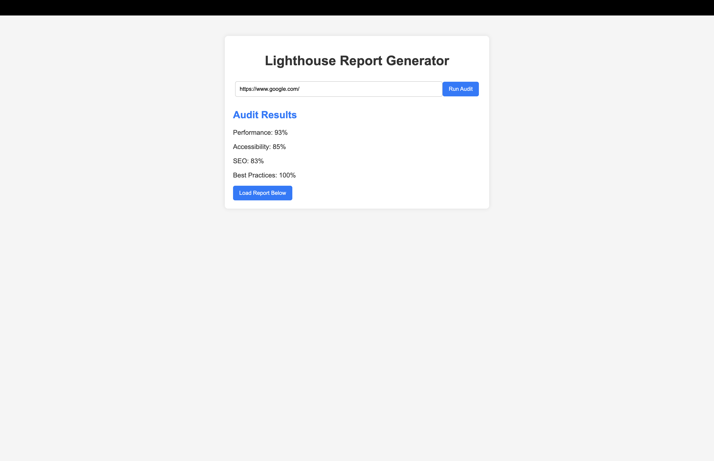
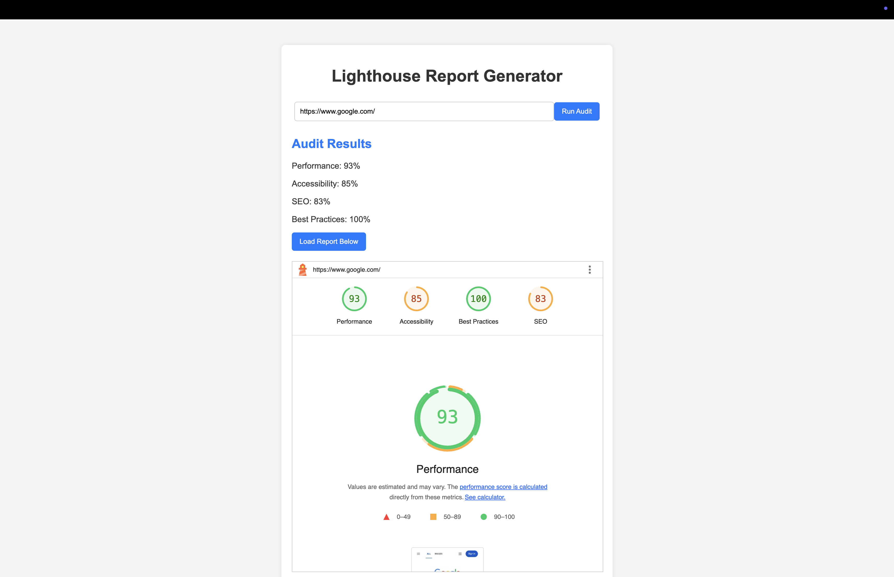
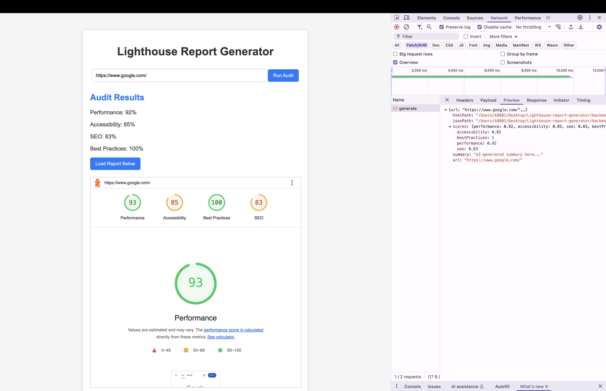

# Lighthouse Report Generator

## 🚀 Overview
This project is a Lighthouse Report Generator that allows users to:
✅ Enter a website URL and run a Lighthouse audit  
✅ Generate and display a summary report (Performance, Accessibility, SEO, Best Practices)  
✅ Use the report to generate a summary & create a report on how to overcome the issues using any LLM tool  
✅ Allow users to download the full report (JSON or HTML)  

## 🛠️ Implementation Details
### Backend (Node.js)
The backend is implemented using Node.js with express and provides an API endpoint (`POST /generate`) that:
- Accepts a website URL as input
- Runs a Lighthouse audit for the given URL
- Returns a summary of the report (Performance, Accessibility, SEO, Best Practices)
- Saves the full report as JSON and HTML
- Stores reports in /backend/reports folder
- Handles error cases such as invalid URLs and server failures

### Frontend (React.js)
The frontend is implemented using React.js, providing a simple UI where a user can:
- Enter a website URL and trigger an audit
- View the summary of the report
- Download the full report in JSON or HTML format

## 📦 Project Setup
### Installation Instructions
Ensure you have Node.js (v16+) installed.

1. Clone the repository:
   ```sh
   git clone https://github.com/yourusername/lighthouse-report-generator.git
   cd lighthouse-report-generator
   ```
2. Project structure has backend and frontend separated out, so we would require to install dependencies on each separately. Follow the steps below to setup the project.

3. Setup and Start the backend server:
   ```sh
   cd backend
   npm install
   node server.js
   ```

4. Setup and Start the frontend:
   ```sh
   cd frontend
   npm install
   npm run dev
   ```

The frontend runs on `http://localhost:5000` and the backend on `http://localhost:3000/api/audit/generate`.

## 📄 Usage
1. Enter a website URL in the frontend UI.
2. Click "Run Audit" to trigger a Lighthouse audit.
3. View the generated report summary.
4. Download the full report in JSON or HTML format.

## Screenshots of UI




## 📌 Repository
[GitHub Repository](https://github.com/yourusername/lighthouse-report-generator)

---
This project is fully implemented and ready for use! 🚀
